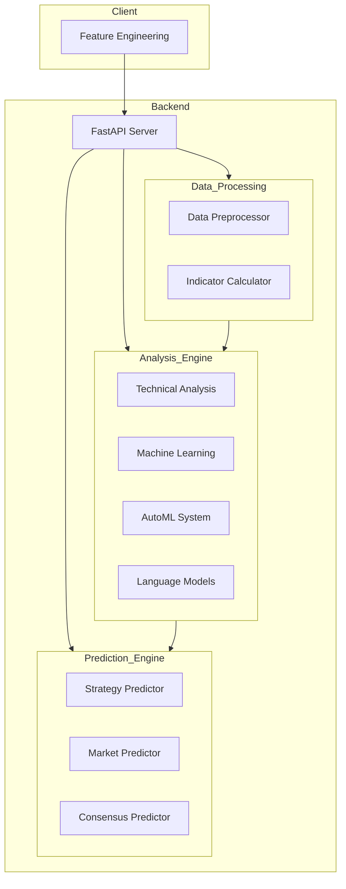
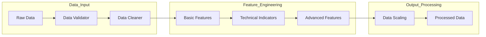
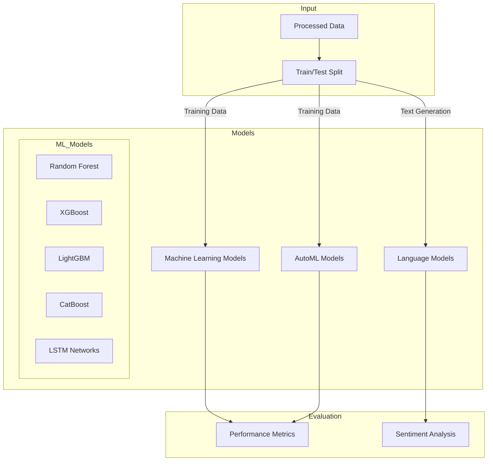
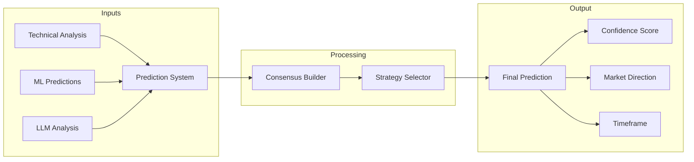
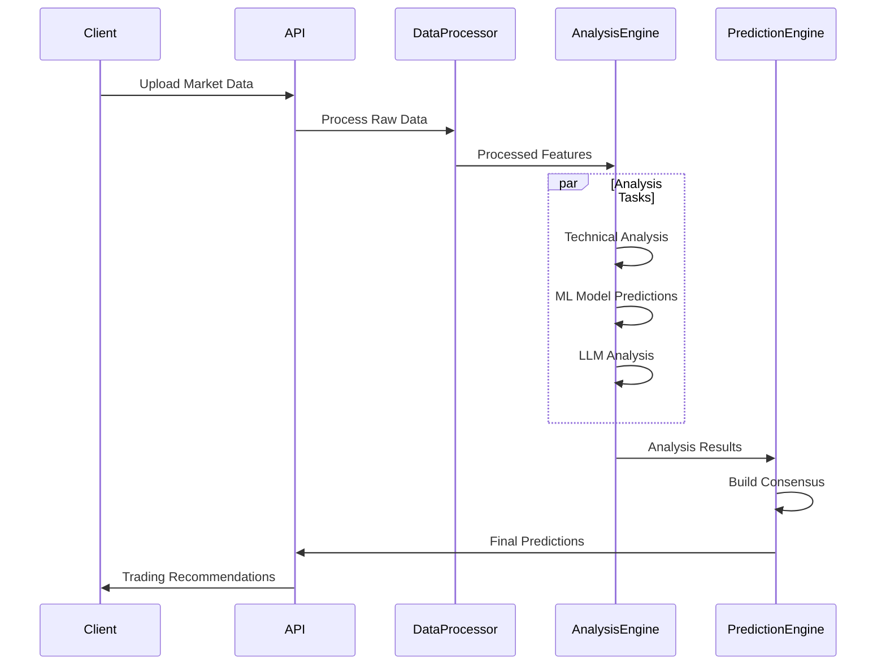

# Trading Analysis Backend

A sophisticated trading analysis system that combines traditional technical analysis with modern machine learning and natural language processing techniques.

## System Architecture



## Core Components

### 1. Data Processing Engine


### 2. Analysis Engine


### 3. Prediction Engine


## API Endpoints

### Technical Analysis Routes
- `POST /analyze`: Comprehensive technical analysis
- `POST /analyze-models`: Model-based analysis
- `POST /predict`: Market predictions

### AutoML Routes
- `POST /api/automl/analyze`: AutoML analysis
- `GET /api/automl/models`: Available AutoML models

### LLM Routes
- `POST /api/v1/analyze`: LLM-based analysis
- `POST /api/v1/analyze-all`: Multi-model LLM analysis

## Core Features

### 1. Technical Analysis
- Volume Indicators
  - Force Index
  - Money Flow Index
  - On-Balance Volume
- Momentum Indicators
  - RSI
  - MACD
  - Awesome Oscillator
- Trend Indicators
  - ADX
  - Ichimoku Cloud
  - Moving Averages

### 2. Machine Learning Models
- Traditional Models
  - Random Forest
  - Gradient Boosting
  - Support Vector Machines
- Deep Learning
  - LSTM Networks
  - Neural Networks
- Ensemble Methods
  - Voting Classifiers
  - Stacking Classifiers

### 3. AutoML Capabilities
- Automated Feature Selection
- Model Selection
- Hyperparameter Optimization
- Cross-Validation
- Model Evaluation

### 4. LLM Integration
- FinBERT: Financial Sentiment
- BERT: Pattern Recognition
- GPT-2: Trading Patterns
- RoBERTa: Technical Analysis
- XLNet: Volume Analysis

## Data Flow



## Setup Instructions

1. Install Dependencies:
```bash
pip install -r requirements.txt
```

2. Environment Setup:
```bash
# Set up environment variables
export PYTHONPATH="${PYTHONPATH}:/path/to/backend"
```

3. Run the Server:
```bash
uvicorn main:app --host 0.0.0.0 --port 8000 --reload
```

## Docker Support

Build and run using Docker:
```bash
docker build -t trading-analysis-backend .
docker run -p 8000:8000 trading-analysis-backend
```

## Performance Considerations

1. Data Processing
   - Efficient pandas operations
   - Vectorized calculations
   - Caching mechanisms

2. Model Optimization
   - Batch processing
   - Model caching
   - Parallel prediction

3. API Performance
   - Async operations
   - Connection pooling
   - Response compression

## Error Handling

The system implements comprehensive error handling:
- Input validation
- Data quality checks
- Model prediction safeguards
- API error responses

## Monitoring

Key metrics monitored:
- API response times
- Model prediction accuracy
- System resource usage
- Error rates and types

## Security

- CORS configuration
- Input sanitization
- Rate limiting
- Authentication (if required)

## Contributing

1. Fork the repository
2. Create feature branch
3. Commit changes
4. Create pull request

## License

MIT License - See LICENSE file for details
