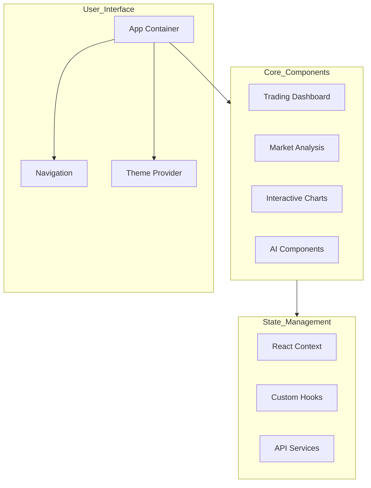
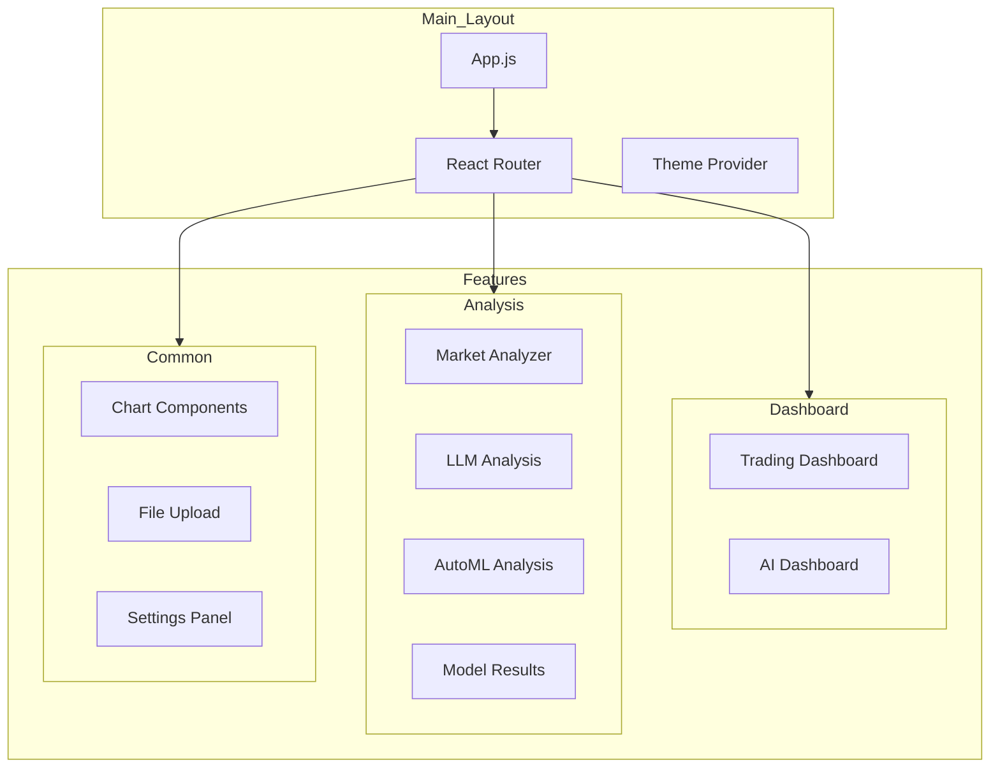
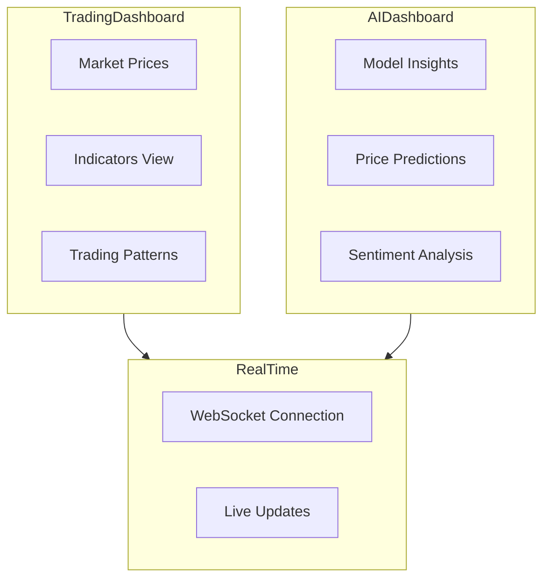
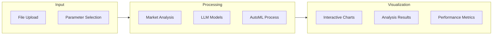

# Trading Analysis Frontend

A modern, responsive React-based frontend for the Trading Analysis platform, featuring advanced visualization, real-time updates, and AI-powered insights.

## Architecture Overview



## Component Structure



## Key Components

### 1. Dashboard Components


### 2. Analysis Components


## Features

### 1. User Interface
- Material-UI components
- Responsive design
- Dark/Light theme support
- Animated transitions
- Interactive charts

### 2. Trading Dashboard
- Real-time price updates
- Technical indicators
- Trading patterns
- Volume analysis
- Price predictions

### 3. Analysis Tools
- Market analysis
- LLM model integration
- AutoML capabilities
- Performance metrics
- Result visualization

### 4. Charts and Visualization
- TradingView integration
- Custom chart components
- 3D visualizations
- Interactive elements
- Real-time updates

## Technical Stack

### Core Technologies
- React 18
- Material-UI
- React Router
- Framer Motion
- Three.js

### Chart Libraries
- TradingView Lightweight Charts
- Recharts
- React Three Fiber

### State Management
- React Context
- Custom Hooks
- Local Storage

## Component Directory Structure

```
src/
├── components/
│   ├── Analysis/
│   │   ├── MarketAnalyzer.js
│   │   ├── LLMModelAnalysis.js
│   │   ├── AutoMLAnalysis.js
│   │   └── ModelResults.js
│   ├── Dashboard/
│   │   ├── TradingDashboard.js
│   │   └── AIDashboard.js
│   ├── Chart/
│   │   └── ChartComponents.js
│   └── Settings/
│       └── Settings.js
├── context/
│   └── AppContext.js
├── hooks/
│   └── useWebSocket.js
├── services/
│   └── api.js
└── App.js
```

## Setup Instructions

1. Install Dependencies:
```bash
npm install
```

2. Environment Setup:
```bash
# Create .env file
REACT_APP_API_URL=http://localhost:8000
REACT_APP_WS_URL=ws://localhost:8000/ws
```

3. Run Development Server:
```bash
npm start
```

## Development Workflow

### 1. Component Development
- Atomic design principles
- Reusable components
- Prop type validation
- Error boundaries

### 2. State Management
- Context for global state
- Local state for components
- Custom hooks for logic
- Memoization for performance

### 3. API Integration
- Axios for HTTP requests
- WebSocket for real-time
- Error handling
- Loading states

## Performance Optimization

1. Code Splitting
   - React.lazy loading
   - Route-based splitting
   - Component chunking

2. Rendering Optimization
   - useMemo hooks
   - React.memo
   - Virtual lists
   - Debounced updates

3. Asset Optimization
   - Image compression
   - Lazy loading
   - CDN integration

## Testing

1. Unit Tests
   - Component testing
   - Hook testing
   - Service testing

2. Integration Tests
   - User flows
   - API integration
   - State management

3. E2E Tests
   - Critical paths
   - User journeys
   - Cross-browser testing

## Security Measures

- Input validation
- XSS prevention
- CSRF protection
- Secure storage
- API security

## Contributing

1. Fork repository
2. Create feature branch
3. Implement changes
4. Submit pull request

## License

MIT License - See LICENSE file for details
